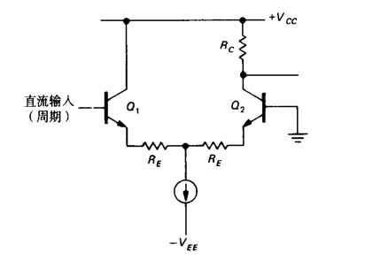

如同简单发射极接地放大器一样，有时也想要一个具有很高增益的单级差分放大器。一种很好的解决方法如图2.72所示，采用镜像电流源作为有源负载。图中0.0，是具有发射极电流源的差分对，2与0.是一个电流源，构成集电极负载。由这个镜像电流源提供的高集电极负载电阻提供一个高达5000或更高的电压增益（假设放大器输出端空载）。这种放大器通常只用于反馈环内部，或作为比较器（将在下节讨论）。一定要记住这种放大器要加高阻抗负载，否则它的增益将大幅度下降。

